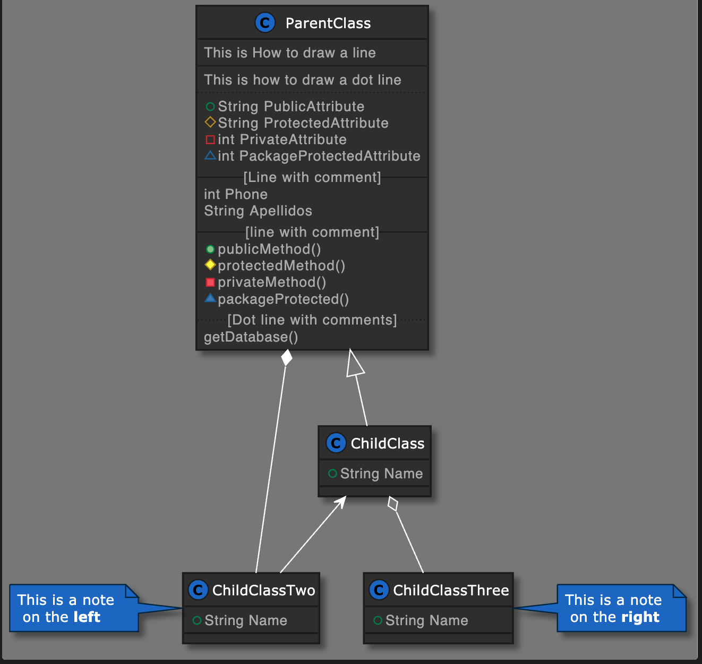

# Documentation and PlantUML


[PlantUML](https://plantuml.com) is an open-source project, that allows you to create technical documentation for your project, and will transform this code:

```
@startuml

!define DARKBLUE
!includeurl https://raw.githubusercontent.com/Drakemor/RedDress-PlantUML/master/style.puml
class ParentClass {
    This is How to draw a line
    --
    This is how to draw a dot line
    ..
    +String PublicAttribute
    #String ProtectedAttribute
    -int PrivateAttribute
    ~int PackageProtectedAttribute
    --[Line with comment]--
    int Phone
    String Apellidos
    --[line with comment]--
    +publicMethod()
    #protectedMethod()
    -privateMethod()
    ~packageProtected()
   ..[Dot line with comments]..
    getDatabase()
}

class ChildClass {
    +String Name
}

class ChildClassTwo {
    +String Name
}
note left: This is a note \n on the <b>left</b>


class ChildClassThree {
    +String Name
}
note right: This is a note \n on the <b>right</b>

' Changing the type of union
ParentClass <|-- ChildClass
ParentClass *-- ChildClassTwo
ChildClass <-- ChildClassTwo
ChildClass o-- ChildClassThree

@enduml
```

Into this diagram:
<br>

  
<br><br>

### You can create:

- Sequence diagram
- Usecase diagram
- Class diagram
- Object diagram
- Activity diagram (here is the legacy syntax)
- Component diagram
- Deployment diagram
- State diagram
- Timing diagram

### To Install PlantUML

- Install Java in our Computer <br>
- Install [GraphViz](https://plantuml.com/de/graphviz-do) <br>
- Install the PlantUML Extension for your IDE <br>

### Resources PlantUML

- You can find rich and full examples of how to define different diagrams [here](https://real-world-plantuml.com/) <br>
- Custom style used [here](https://github.com/Drakemor/RedDress-PlantUML)
- [Official documentation](https://plantuml.com/de/)
- Full detail documentation [here](https://crashedmind.github.io/PlantUMLHitchhikersGuide/index.html#)


Thanks!